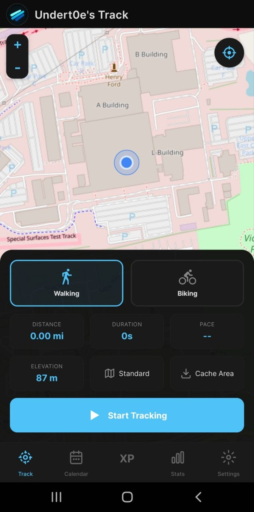
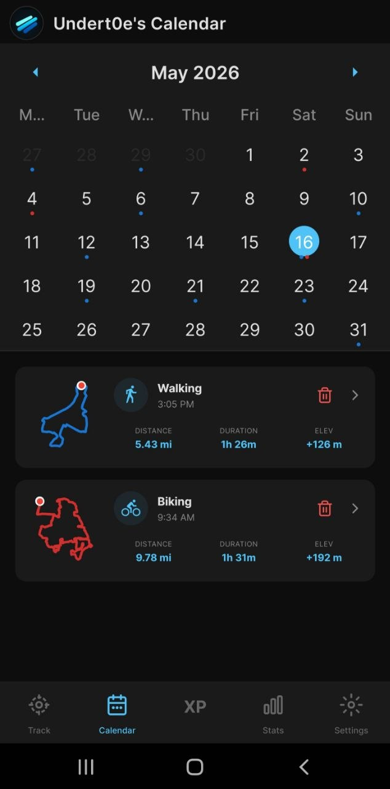
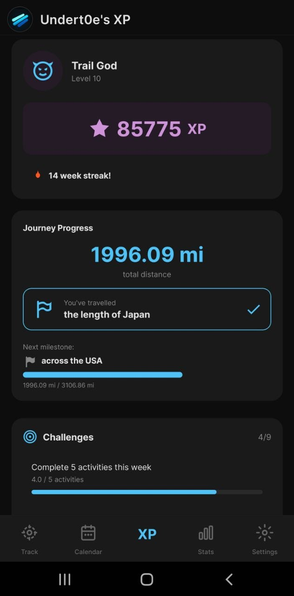
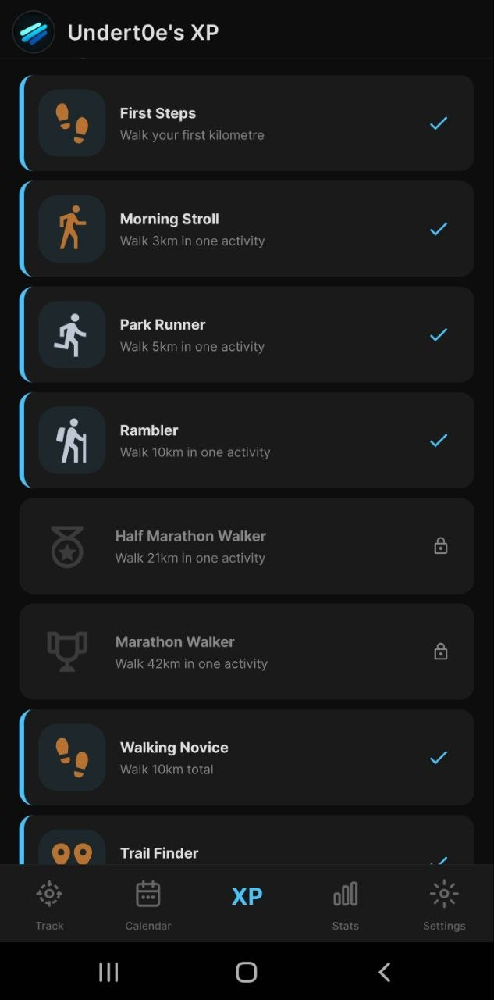
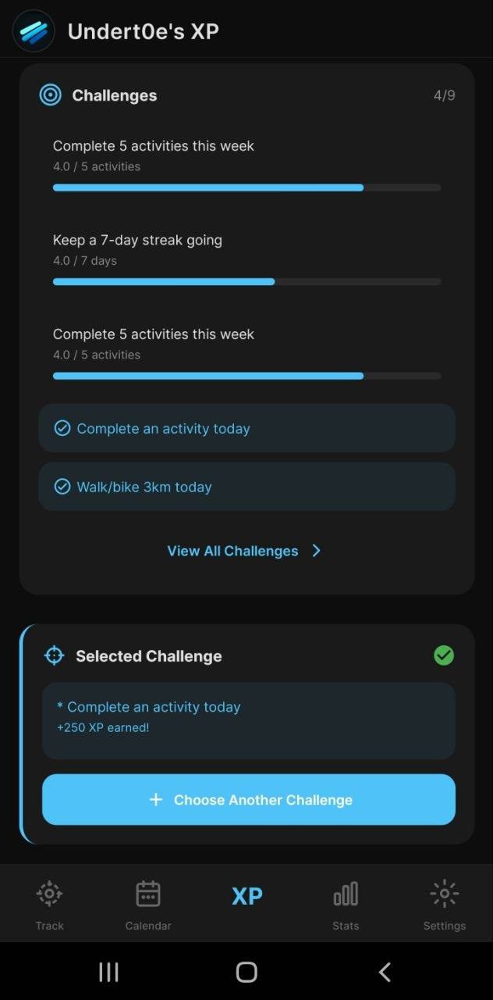
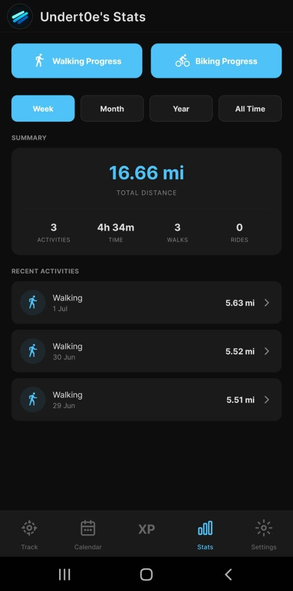
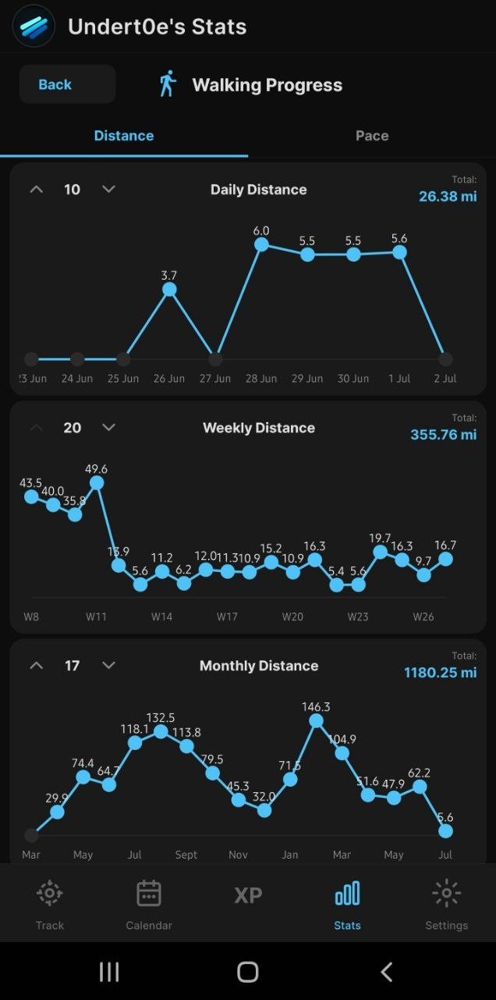
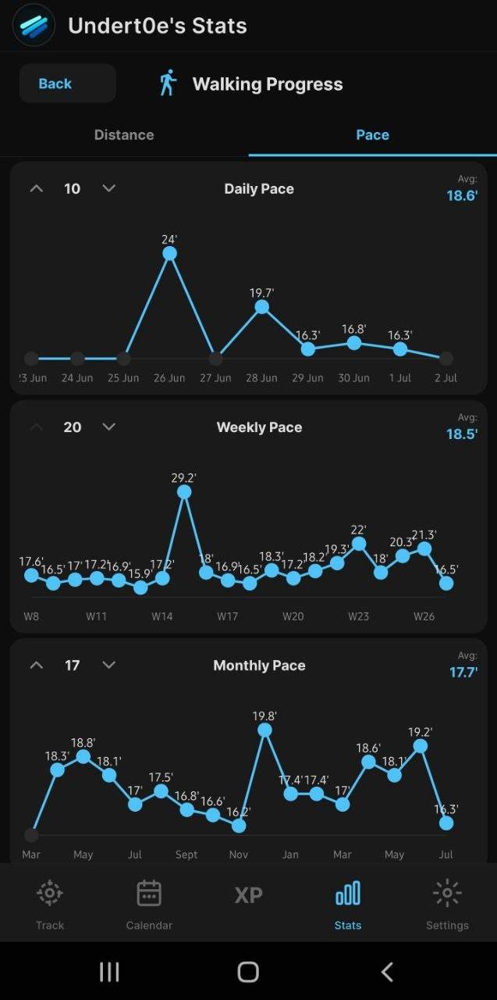
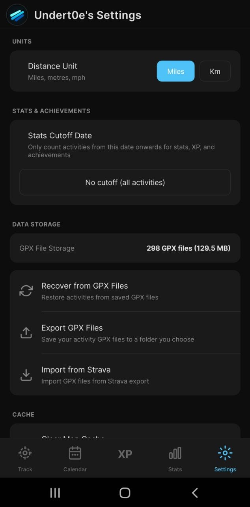

# TrailTrackerXP

Dark Android GPS tracker for walking and biking, with GPX storage, stats, XP progression, achievements, and selectable challenges.

## Screenshots

<p float="left">
  
  
  
</p>
<p float="left">
  
  
  
</p>
<p float="left">
  
  
  
</p>

## Features

### Track

- GPS route tracking with live map display
- Walking and biking modes
- Route preview before saving
- Pause / resume / stop / save
- Distance, duration, elevation, and pace metrics
- Routes stored as GPX files on device

### Calendar

- Activity history by date
- Route thumbnails on the calendar grid
- Tap any day to see activity details
- Saved activity review with route playback

### XP

- XP and levels with progression bar
- Weekly streaks
- Achievements with bronze / silver / gold tier colours
- Auto / random daily and weekly challenges
- Selectable challenges — pick your own goal
- Bonus XP awarded on selected challenge completion
- Challenge progress starts when you select it (historical activities don't retroactively complete challenges)

### Stats

- Walking and biking progress side-by-side
- Distance and pace views with a highlight selector
- Daily, weekly, monthly, and all-time charts
- Recent activities list (newest first)

### Settings

- Miles / kilometres toggle
- Stats cutoff date
- GPX file storage (count, recover, export, import)
- Strava GPX import
- Map tile cache management

## Challenges and XP

- **Auto challenges** are generated daily and weekly — walking, biking, streak, and activity-count goals.
- **Selected challenges** let you pick from a filtered list of offerable challenges. Completing a selected challenge awards bonus XP.
- Challenge offers avoid challenges you already have in flight, and challenges whose target you've already met in the current rule window.
- Selected challenge progress starts from the time of selection, so historical activities don't retroactively complete a challenge.
- Bonus XP is awarded once per challenge completion (persisted to prevent duplicates).

See [`docs/CHALLENGES.md`](docs/CHALLENGES.md) for the full challenge system design.

## Build

Local build only — no EAS cloud.

```powershell
# Preview build (debug-signed, JS bundled, no Metro needed — for phone QA)
.\scripts\build-and-release.ps1 -PreviewBuild

# Release build (release-signed with release.keystore, minified)
.\scripts\build-and-release.ps1 -ReleaseBuild
```

- **Preview build:** standalone APK, signed with the debug key. Use for local phone QA.
- **Release build:** signed with the release keystore, ProGuard minified. Use for public releases.
- The `android/` directory is generated by `expo prebuild` and is not committed.
- No EAS cloud build is needed — the local build script handles everything.

See [`docs/BUILD_AND_RELEASE.md`](docs/BUILD_AND_RELEASE.md) for full build documentation.

## Releases

Latest release: **v1.2.0**

[Releases page](https://github.com/Undert0e-505/TrailTrackerXP/releases)

## Development

- [Development Guide](docs/DEVELOPMENT.md) — setup, project structure, data storage, Strava import
- [Build & Release Guide](docs/BUILD_AND_RELEASE.md) — local build, APK creation, signing
- [Challenges Design](docs/CHALLENGES.md) — challenge system architecture and rules
- [Garmin Companion](docs/GARMIN_COMPANION.md) — Connect IQ watch app

## Tech Stack

| Layer | Technology |
|-------|-----------|
| Framework | React Native + Expo (SDK 51) |
| Navigation | React Navigation (bottom tabs + native stack) |
| Maps | react-native-maps + WebView tile caching |
| Storage | AsyncStorage + FileSystem (JSON + GPX) |
| Charts | Custom SVG (react-native-svg) |
| Fonts | Inter (@expo-google-fonts/inter) |
| Garmin | Connect IQ / Monkey C |

## License

Private project. All rights reserved.